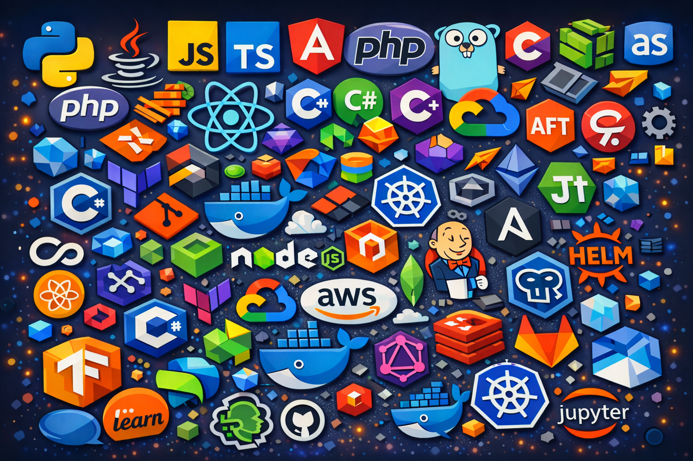

<!-- ===================== PROFILE PHOTO ===================== -->

  
 

<h1 align="center">
  Hi! I'm Shifa
  
</h1>

  

<!-- ===================== TECHNOLOGIES ===================== -->

## Technologies

### Languages

  

### Frontend

  

### Backend

  

### Databases

  

### AI / ML

  

### Cloud & DevOps

  

---

<!-- ===================== CONTRIBUTION GRAPH ===================== -->

## Contribution Activity

  

<!-- ===================== GITHUB STATS ===================== -->

## GitHub Statistics

  

<!-- ===================== CONTRIBUTION SNAKE ===================== -->

##  Contribution Snake

  

<!-- ===================== CONNECT ===================== -->

  
  &nbsp;&nbsp;&nbsp;
  

---

  

